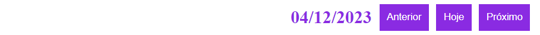
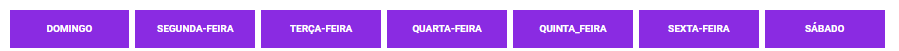
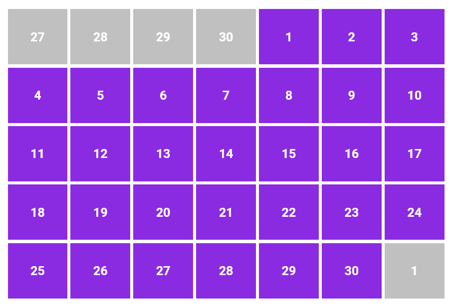

# Docs

## Props

<table>

<thead>
    <tr>
        <td>Prop</td>
        <td>type</td>
        <td>Description</td>
    </tr>
</thead>
<tbody>
    <tr>
        <td><a href="#config">config</a></td>
        <td>Object</td>
        <td>Date formatting setup</td>
    </tr>
    <tr>
        <td>long-week</td>
        <td>Boolean</td>
        <td>Whether the week will be displayed in extended format</td>
    </tr>
     <tr>
        <td><a href="#size">size</a></td>
        <td>String</td>
        <td>Sets the size of the calendar</td>
    </tr>
    <tr>
        <td>header-style</td>
        <td>Object</td>
        <td>Header style with calendar controller</td>
    </tr>
</tbody>
</table>

## Slots

<table>
    <thead>
        <tr>
            <td>Name</td>
            <td>Props</td>
            <td>Description</td>
        </tr>
    </thead>
    <tbody>
        <tr>
            <td><a href="#header">header</a></td>
            <td>events</td>
            <td>Calendar header with controls</td>
        </tr>
        <tr>
            <td><a href="#header-date">header-date</a></td>
            <td>date</td>
            <td>Date display in calendar header</td>
        </tr>
         <tr>
            <td><a href="#control-buttons">control-buttons</a></td>
            <td>events</td>
            <td>forward and backward buttons</td>
        </tr>
        <tr>
            <td><a href="#week">week</a></td>
            <td>week</td>
            <td>Week view on calendar</td>
        </tr>
        <tr>
            <td><a href="#day">day</a></td>
            <td>day</td>
            <td>Day view on calendar</td>
        </tr>
         <tr>
            <td><a href="#header-date">header-date</a></td>
            <td>date</td>
            <td>Date view on calendar header</td>
        </tr>
         <tr>
            <td><a href="#control-buttons">control-buttons</a></td>
            <td>events</td>
            <td>Control buttons in the calendar header</td>
        </tr>
    </tbody>
</table>

## Definitions

### Props

#### Config

```javascript
{
        locale: "pt-br",
        formatDate:'DD/MM/YYYY',
        formatTime:'HH:MM:mm',
        months: [
          "Janeiro",
          "Fevereiro",
          "Março",
          "Abril",
          "Maio",
          "Junho",
          "Julho",
          "Agosto",
          "Setembro",
          "Outubro",
          "Novembro",
          "Dezembro",
        ],
        monthsShort: [
          "Jan",
          "Fev",
          "Mar",
          "Abr",
          "Mai",
          "Jun",
          "Jul",
          "Ago",
          "Set",
          "Out",
          "Nov",
          "Sez",
        ],
        weekdays: [
          "Domingo",
          "Segunda-Feira",
          "Terça-Feira",
          "Quarta-Feira",
          "Quinta_feira",
          "Sexta-Feira",
          "Sábado",
        ],
        weekdaysShort: ["Dom", "Seg", "Ter", "Qua", "Qui", "Sex", "Sab"],
      }
```

#### Size

| String | Description   |
| ------ | ------------- |
| large  | 900px X 900px |
| medium | 700px X 700px |
| small  | 400px X 400px |
| thin   | 300px X 300px |

### Slots

### Header

 

```html
<template #header="{ events , date}">
  <h2
    :style="{
       fontSise:'18px',
       color:'blueviolet',
       margin:'0 5px'
   }"
  >
    {{ date }}
  </h2>
  <button
    :style="{
       backgroundColor: 'blueviolet',
       color: 'white',
       padding: '10px',
       border: 'none',
       margin: '0 5px',
       }"
    @click="events.previous()"
  >
    Anterior
  </button>
  <button
    :style="{
       backgroundColor: 'blueviolet',
       color: 'white',
       padding: '10px',
       border: 'none',
       margin: '0 5px',
   }"
    @click="events.current()"
  >
    Hoje
  </button>
  <button
    :style="{
       backgroundColor: 'blueviolet',
       color: 'white',
       padding: '10px',
       border: 'none',
       margin: '0 5px',
       }"
    @click="events.next()"
  >
    Próximo
  </button>
</template>
```

### Header-Date

 

```html
<template #header-date="{date}">
  <h2
    :style="{
       fontSise: '18px',
       color: 'blueviolet',
       margin: '0 5px',
   }"
  >
    {{ date }}
  </h2>
</template>
```

### Control-Buttons

 

```html
<template #control-buttons="{ events }">
  <div>
    <button
      :style="{
           backgroundColor: 'blueviolet',
           color: 'white',
           padding: '10px',
           border: 'none',
           margin: '0 5px',
           }"
      @click="events.previous()"
    >
      Anterior
    </button>
    <button
      :style="{
           backgroundColor: 'blueviolet',
           color: 'white',
           padding: '10px',
           border: 'none',
           margin: '0 5px',
           }"
      @click="events.current()"
    >
      Hoje
    </button>
    <button
      :style="{
           backgroundColor: 'blueviolet',
           color: 'white',
           padding: '10px',
           border: 'none',
           margin: '0 5px',
           }"
      @click="events.next()"
    >
      Próximo
    </button>
  </div>
</template>
```

### Week

 

```html
<template #week="{week}">
  <p
    :style="{
           backgroundColor:'blueviolet',
           height:'30px',
           display:'flex',
           justifyContent:'center',
           alignItems:'center',
           color:'white',
           fontSize:'8px',
           textTransform:'uppercase',
           fontFamily:'Roboto'
       }"
  >
    {{ week }}
  </p>
</template>
```

### Day

 
> Object Day

```javascript
{
  value: firstDayNext,//calendar day in number
  currentMonth: <Boolean>,// If the day corresponds to the current display month
}
```

```html
<template #day="{day}">
  <p
    :style="{
           backgroundColor:day.currentMonth ? 'blueviolet' : 'silver',
           height:'100%',
           display:'flex',
           justifyContent:'center',
           alignItems:'center',
           color:'white',
           fontSize:'20px',
           textTransform:'uppercase',
           fontFamily:'Roboto'
       }"
  >
    {{ day.value }}
  </p>
</template>
```
